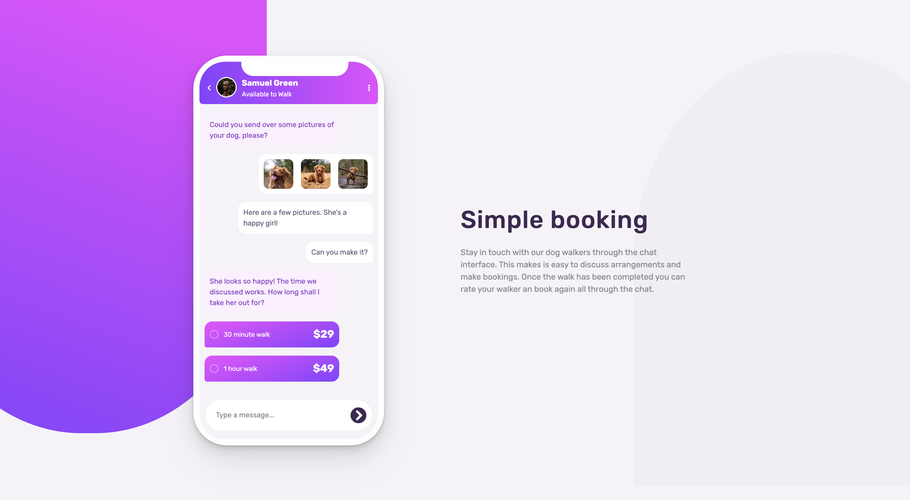
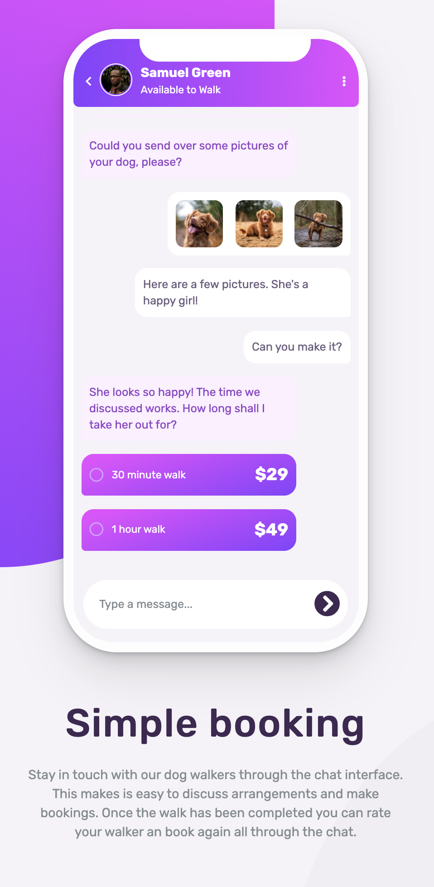

# Frontend Mentor - Chat app CSS illustration solution

This is a solution to the [Chat app CSS illustration challenge on Frontend Mentor](https://www.frontendmentor.io/challenges/chat-app-css-illustration-O5auMkFqY). Frontend Mentor challenges help you improve your coding skills by building realistic projects.

## Table of contents

- [Overview](#overview)
  - [The challenge](#the-challenge)
  - [Screenshot](#screenshot)
  - [Links](#links)
- [Built with](#built-with)
- [Acknowledgments](#acknowledgments)

## Overview

### The challenge

Users should be able to:

- View the optimal layout for the component depending on their device's screen size
- **Bonus**: See the chat interface animate on the initial load 💬

### Screenshot

### Links

- Solution URL: [https://www.github.com/holjas/ChatApp](https://www.github.com/holjas/ChatApp)
- Live Site URL: [https://github.holjas.io/ChatApp](hhttps://github.holjas.io/ChatApp)

## Built with

- Semantic HTML5 markup
- Sass (SCSS)
- Flexbox
- jQuery

## Acknowledgments

Phone design adapted from https://marvelapp.github.io/devices.css/
Chat animation adapted from Clemens https://codepen.io/clemens/pen/kXZWOK
